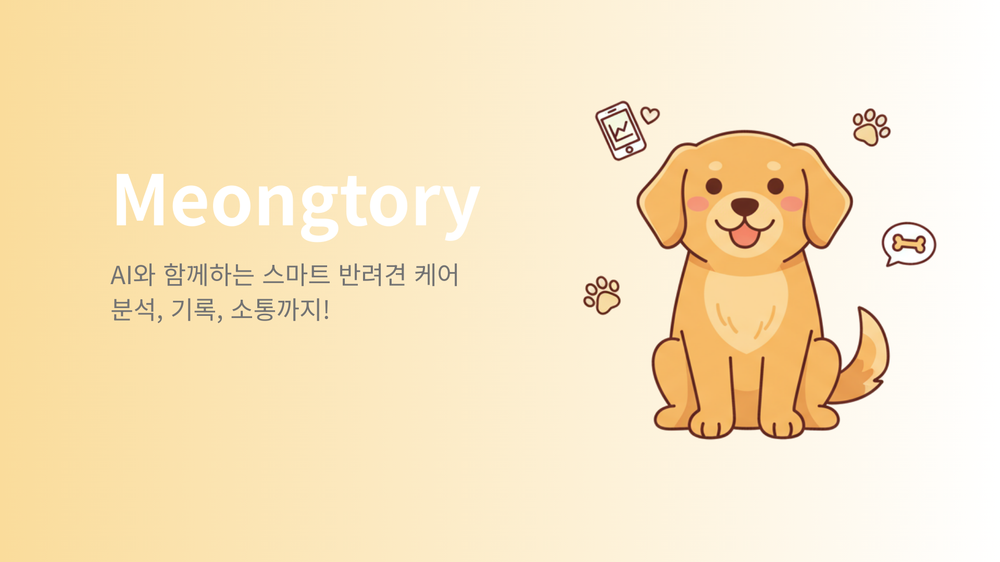
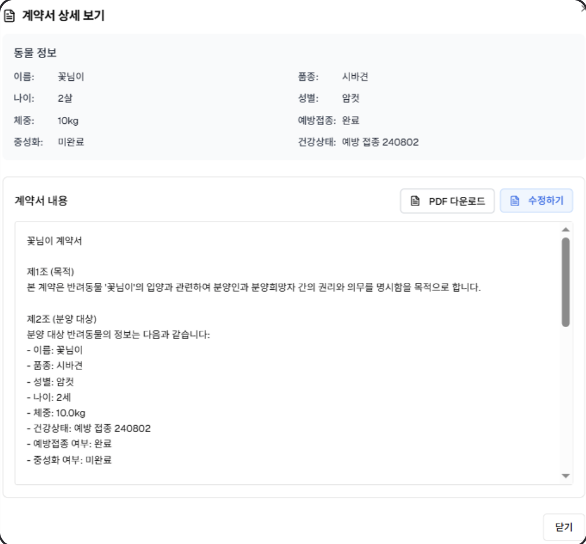
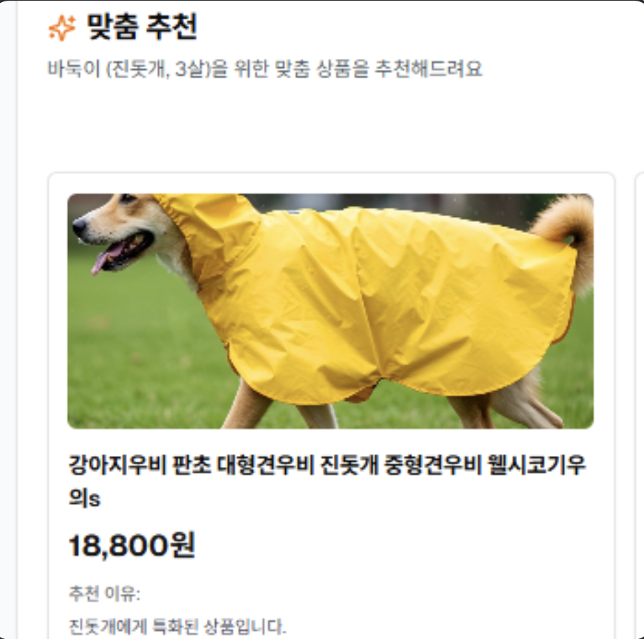
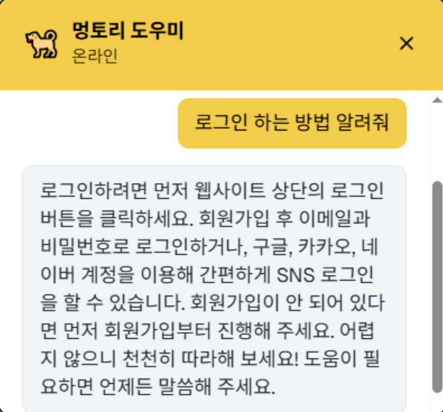
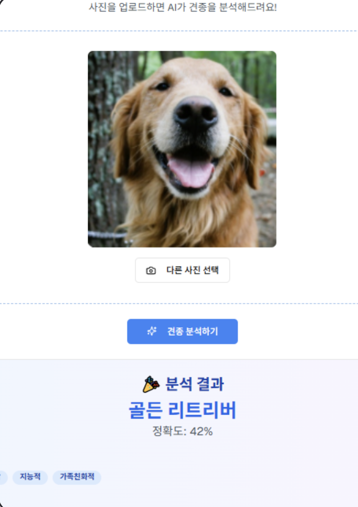
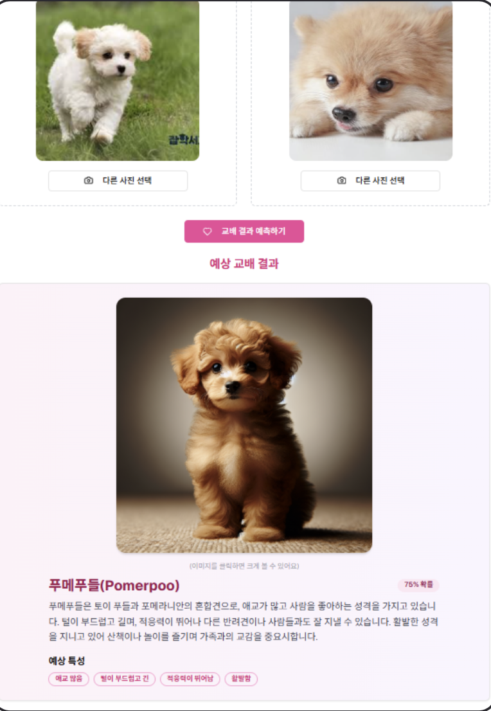
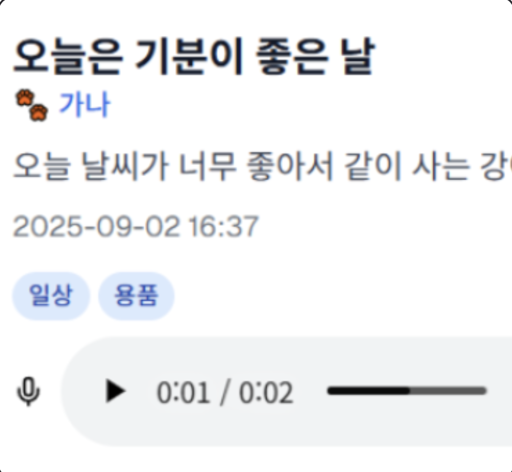
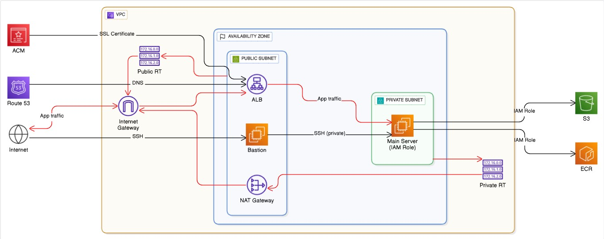

# 🐕 Meongtory - 반려견과의 일상을 더 스마트하게!

#### Meongtory는 반려견과 함께하는 사람들을 위한 AI 기반 올인원 플랫폼입니다. 입양 스토리와 성장 일기, 커뮤니티, 스토어 기능을 제공하며, AI 챗봇과 이미지 분석을 통해 반려견의 건강, 기분, 행동을 더 깊이 이해할 수 있도록 돕습니다.
## 🎥 시연영상

https://www.youtube.com/watch?v=IbkFuse7MNc

<table>
  <tr>
    <td></td>
    <td></td>
    <td></td>
  </tr>
  <tr>
    <td></td>
    <td></td>
    <td></td>
  </tr>
</table>

## ✨ 기술스택
#### FRONT-END
          

#### BACK-END
        
   
 

## 🔧 서비스 아키텍처

 

 

## ✨ 프로젝트 소개
### 🐾 Meongtory — 입양부터 성장 기록, 반려견 커뮤니티까지!
>1. **따뜻한 입양 스토리를 공유하세요**  
   반려견을 맞이한 감동적인 순간과 배경 이야기를 기록하고 다른 사용자들과 나눌 수 있어요.
>2. **성장 일기를 손쉽게 작성해보세요**  
   음성(STT)과 사진 업로드만으로 자동으로 일기를 작성하고 카테고리별로 정리할 수 있어요.
>3. **AI가 분석하는 반려견 이미지와 감정**  
   사진을 업로드하면 AI가 품종, 건강 상태, 기분을 분석해줍니다.
>4. **반려견 맞춤 스토어 추천**  
   커뮤니티 데이터와 AI 분석을 기반으로 맞춤형 용품과 상품을 추천해드려요.
>5. **반려인 커뮤니티에서 소통하세요**
   자유롭게 질문하고 경험, 팁, 후기를 공유할 수 있는 반려인 전용 커뮤니티가 마련돼 있어요.

## 🌟 핵심 기능

### 📜 AI 계약서 자동 생성

> * 입양 시 필요한 계약서를 AI가 자동으로 작성해줍니다.
> * 템플릿 항목과 반려견 정보를 입력하면, 지정된 프롬프트를 기반으로 계약서가 완성돼요.

### 🎙 성장일기 STT AI 서비스

> * 반려견과의 순간을 음성으로 기록하면 AI가 이를 텍스트로 변환해줍니다.
> * 변환된 기록은 자동으로 성장일기에 저장되어 추억을 간직할 수 있어요.

### 🖼 성장일기 이미지 분석

> * 일기에 반려견 사진을 업로드하면 AI가 이미지를 분석합니다.
> * 옷, 약, 장난감 등 주요 태그를 자동으로 추출해줍니다.

### 🛍 AI 맞춤 상품 추천

> * 반려동물 정보를 기반으로 맞춤형 상품을 추천해줍니다.
> * 커뮤니티와 데이터 분석을 활용해 실질적으로 필요한 상품을 제안해요.

### 💬 반려견 챗봇

> *  반려견 관련 질문에 AI 챗봇이 실시간으로 답변합니다.
> *  건강, 훈련, 생활 팁 등 다양한 주제를 다룰 수 있어요.

### 🐕 품종 분석 AI 서비스

> *  반려견 사진을 업로드하면 AI가 품종을 분석해줍니다.
> *  정확도와 주요 특성을 함께 제공해, 반려견 이해를 도와줘요.

### 🧬 교배 예측 AI 서비스

> *  부모 반려견 이미지를 업로드하면 AI가 품종을 인식합니다.
> *  교배 결과와 예상 강아지 이미지를 생성해 보여줍니다.

## 😺 멤버
|[🔰이환섭](http)|[주재정](https://github.com/Rabbokki)|[이효진](http)|[배지한](http)|[정혜선](http)|            
|:---:|:---:|:---:|:---:|:---:|
||||||

